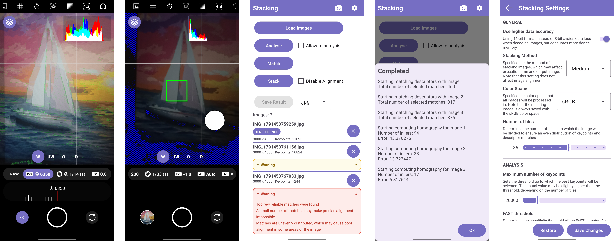

# StackingCamera - Manual Camera & Multi-Frame Image Stacking

An Android application combining a manual-control camera (Camera2 API) with a native, GPU-accelerated multi-frame image stacking pipeline. Built as a Bachelor's thesis project in Software Engineering.

## Table of Contents

- [Background](#background)
- [Features](#features)
  - [Camera](#camera)
  - [Image Stacking](#image-stacking)
  - [Stacking Settings](#stacking-settings)
- [Architecture](#architecture)
- [Native Dependencies](#native-dependencies)
- [Device Requirements](#device-requirements)
- [Known Limitations](#known-limitations)
- [Research Note](#research-note)
- [License](#license)

## Background

This project combines two components that were originally developed independently. The image stacking pipeline (keypoint detection, matching, homography estimation, stacking) started as university coursework, with no camera integration. The camera module was built separately afterward as a standalone project. For the thesis, both were merged into a single application and developed together from that point on - the camera module was not further modified independently after the merge.

## Features

### Camera

Photo capture only (no video), built on Camera2 API with the following configurable settings - each one enables/disables independently depending on device/sensor support:

- **Format:** JPG, DNG
- **ISO:** auto or manual
- **Shutter speed:** auto or manual
- **Exposure compensation:** manual only, via slider or swipe-to-adjust while focusing
- **White balance:** Off, Auto, Incandescent, Fluorescent, Warm Fluorescent, Daylight, Cloudy, Twilight, Shade
- **Focus:** Auto (continuous), Fixed (focus-and-lock on tap), Manual (slider). Tap-to-focus works in every mode and shows a square overlay - green on success, red on failure, fading out after 5 seconds
- **Burst mode:** 1-500 shots
- **Camera switching:** dedicated buttons for front and last-used back camera, plus individual buttons for each available back camera (availability depends on device)
- **Live histogram:** per-channel (RGB), drawn over the preview
- **3×3 grid overlay**
- **Self-timer:** off, 2s, 5s, 10s - resets immediately if the shutter is pressed again mid-countdown
- **Focus peaking:** in-focus contours highlighted in green over the preview
- **Zebra patterning:** 45° red stripes for overexposed areas (brightness > 0.96), blue for underexposed areas (brightness < 0.04)
- **Aspect ratio:** 4:3 or 16:9 preview (RAW preview can show 16:9; captured photo is always 4:3)
- **Ghost imaging:** semi-transparent overlay of the last captured photo

**Additional details:**
- Quick access button to the last photo in the gallery
- Preview shutter speed capped at 1/10 s to avoid a laggy preview (no such cap on the actual capture)
- For exposures longer than 1 second, the shutter button shows a live countdown (one decimal place) until the photo is ready
- On capture, the preview briefly flashes black or white (depending on preview brightness) as visual confirmation that a photo was taken
- Long-press on the burst-mode button spawns an additional, draggable shutter button. Dragging it close to the primary button removes it
- Each setting degrades gracefully based on hardware capability (e.g., the front camera may lack focus control, RAW may be unavailable on some modules) - all checked at runtime
- Runtime permissions are requested on launch

### Image Stacking

A separate activity (Kotlin UI, C++/OpenCL computation - Kotlin performs no calculations itself, only displaying minimal per-image metadata: index, name, size, keypoint count, validation status). Workflow:

1. **Load Images** - file picker supporting JPG, PNG, TIFF, and RAW. Each file is validated on load; invalid files are rejected with an explanation. Loaded images appear in a list with name, dimensions, and a remove button.
2. **Analyse** - runs keypoint/descriptor detection on all unanalyzed images, with live progress. Afterward, each image shows its detected keypoint count, and the chosen reference image is marked. An "Allow re-analysis" checkbox forces re-analysis of already-processed images (relevant after a settings change).
3. **Match** - finds point correspondences and transformation matrices against the reference image. Each non-reference image then gets an alignment-quality indicator: no issue (no visual change), a yellow warning, or a red warning - both expandable on tap to show a text explanation of the likely problem. Yellow means alignment *might* be poor; red means it's at high risk of failing outright.
4. **Stack** - applies the computed transforms and stacks the images using the selected method. A "Disable Alignment" checkbox skips `Match` entirely and stacks images as-is, for already-aligned input. The result is held in memory until the next `Stack` run.
5. **Save Results** - exports the stacked image as JPG, PNG, or TIFF (selected via dropdown).

Burst-mode photos are auto-imported by URI when opening this screen directly after a burst capture, skipping the file picker.

**Memory handling:** decoded pixel data is cached to app storage rather than kept fully in memory (only lightweight metadata lives in-process), and read back fully or in chunks as needed. The current cap is hardcoded to 1.5 GB (tuned for the test device) rather than computed from the device's actual available memory - a known simplification, not a computed value. All errors are surfaced to the user via a bottom-popup log.

### Stacking Settings

A separate settings screen; changes require explicit **Save Changes** confirmation, persist across app restarts, and can be reset to defaults at any time.

| Setting | Default | Range | Step | Notes |
|---|---|---|---|---|
| Bit depth | 16-bit | 8 / 16-bit | - | Working bit depth during stacking |
| Stacking method | Median | Median, Average | - | |
| Color space | sRGB | sRGB, Linear sRGB, Adobe RGB, ProPhoto | - | Working color space; output is always saved as sRGB |
| Number of tiles | 36 | 1, 4, 9, 16, 25, 36, 49, 64, 81, 100 | - | Splits the image into tiles for even keypoint/match distribution |
| Max keypoints | 20,000 | 5,000-100,000 | 100 | Actual count may run slightly higher depending on tile count |
| FAST threshold | 20 | 5-60 | 1 | Lower = more sensitive detector |
| M-BRISK pattern scale factor | 10.0 | 1.0-20.0 | 0.5 | Trade-off between descriptor accuracy with low local contrast and point-orientation/descriptor quality |
| Max matches | 500 | 50-2,000 | 10 | Actual count may run slightly higher depending on tile count |
| RANSAC threshold | 1.0 | 0.5-10.0 | 0.5 | Higher tolerates lower-quality matches |
| RANSAC iterations | 10,000 | 1,000-30,000 | 250 | Trade-off between result probability and execution time |
| Save keypoints (debug) | Off | On/Off | - | Draws and saves detected keypoints per image; does not affect the stacking result |
| Save matches (debug) | Off | On/Off | - | Draws and saves matches between each image and the reference; does not affect the stacking result |

## Architecture

- **Kotlin** - UI only. No image processing or computation happens here.
- **`core` (static library, C++)** - all algorithmic logic (keypoint detection, matching, homography, warping, stacking). Platform-agnostic: accesses storage and JNI only through interfaces, with no direct Android dependency.
- **`stacking` (shared library, C++)** - links `core`, exposes the JNI interface consumed by Kotlin, and provides the concrete interfaces `core` depends on.
- **OpenCL** - all heavy computation runs as buffer-based kernels, using global, local, and constant memory where it helps performance:

  - `from_rgb16_to_gray8` / `from_rgb8_to_gray8` - grayscale conversion ahead of feature detection
  - `clahe_make_lut` / `clahe_interpolate` - CLAHE preprocessing
  - `gaussian_blur_horizontal` / `gaussian_blur_vertical` - separable Gaussian blur
  - `resize`
  - `fast_9` - FAST-9 keypoint detection
  - `subpixel_refine` - sub-pixel keypoint position refinement
  - `brisk` - M-BRISK descriptor computation (see [Research Note](#research-note))
  - `find_closest_descriptors` - descriptor matching
  - `warp_perspective_16` / `warp_perspective_8` - perspective warp for alignment, by bit depth

## Native Dependencies

- LittleCMS (lcms2)
- OpenCL
- libpng
- LibRaw
- libtiff
- libjpeg-turbo
- OpenMP (via NDK)
- Eigen

All precompiled for `arm64-v8a` and bundled under `app/src/main/libs/arm64-v8a` (built against API 28).

## Device Requirements

- Android 9+ (only Android 11 and 14 were actually tested)
- CPU: `arm64-v8a`
- OpenCL 2.0+, ≥1 GB global memory
- 4 GB RAM

**Actually tested on:** Realme 6 - Android 11, MediaTek Helio G90T (6× Cortex-A55 @ 2.0 GHz, 2× Cortex-A76 @ 2.05 GHz), 4 GB LPDDR4X RAM, Mali-G76 MC4 (OpenCL 2.1, ~3.6 GB global memory), rear camera Samsung ISOCELL S5KGW1, front camera Samsung ISOCELL S5K3P9.

## Known Limitations

- **Camera settings architecture doesn't scale well.** The current class hierarchy for camera settings makes adding features that differ meaningfully from existing ones (e.g., flash) hard to integrate cleanly.
- **Semi-auto ISO/exposure correctness isn't guaranteed.** This mode isn't implemented through a standard Android API, but through device-specific behavior that happens to work on the test device; it could behave incorrectly elsewhere, and this can't currently be verified without access to other hardware.
- **Camera error handling is likely incomplete.**
- **Fails on Samsung devices** - likely due to a stricter shader compiler affecting preview shaders, and possibly the `program.cl` kernels too; not debuggable without access to an affected device.
- **No automated tests.** The algorithmic core was instead validated empirically as part of the academic thesis (see [Research Note](#research-note)) - this is methodological validation of the algorithm, not software test coverage, and the two shouldn't be conflated.
- **Stacking memory cap (1.5 GB) is hardcoded**, tuned for the test device rather than computed from actual available device memory.

## Research Note

As part of the thesis, the custom **M-BRISK** descriptor (a modification of the original BRISK algorithm) was empirically compared against ORB, BRISK, KAZE, AKAZE, SIFT, and SURF, evaluating speed, accuracy, and parameter stability. This evaluation is part of the written thesis rather than the codebase.

## License
 
This project is licensed under the terms described in [LICENSE](./LICENSE).
